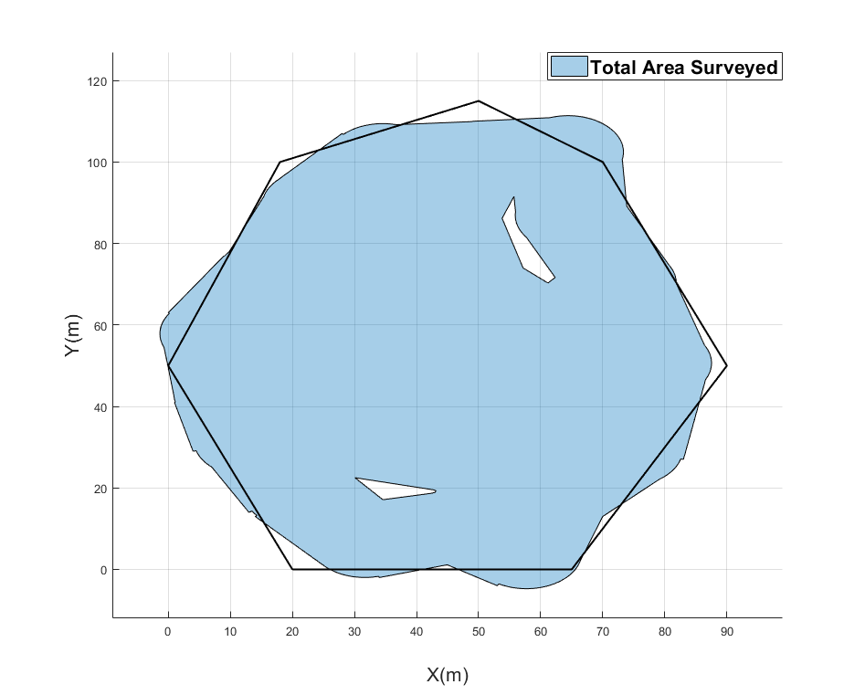
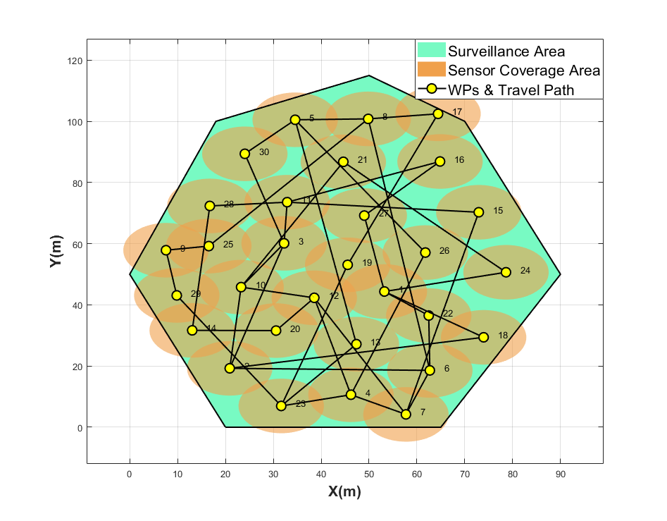

# Search Area Optimization

## Objective
To solve the surveillance problem of a given hostile area, in GPS-denied scenario by deploying multiple vehicles. Vehicles estimate their states collectively by sharing
sensor information with each other, known as Cooperative Localization in literature. For the system to be observable, a path to two landmarks is required. Since deploying landmarks is not a pliable solution all the time, we deploy another team of vehicles that act as a sensor network by maintaining connectivity to landmarks outside the environment, to maintain localization accuracy. Since the overall optimization problem is NP-hard, we divide the problem into three sub-problems: 
- Maximizing surveillance area using Particle Swarm Optimization. 
- Solving Travelling Salesman Problem for efficient vehicle routing and
- developing a control strategy for the sensor network to maintain graph connectivity. We present simulation results using MATLAB/Simulink

## Result

